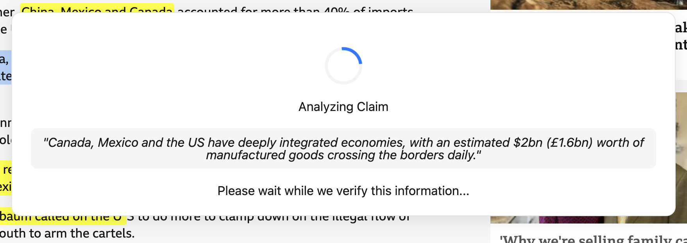
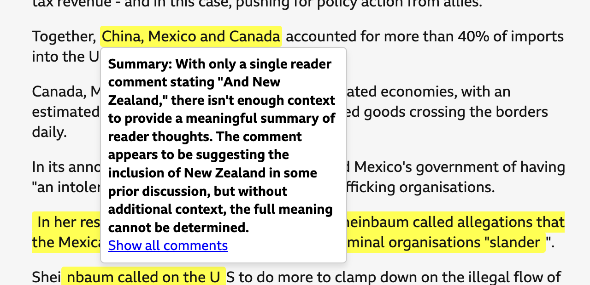

# Aardvark: A Solution for Information and Truth 

Aardvark is a fact-checking and opinion aggregation platform designed to help users validate
claims, discuss statements, and gain insights from community perspectives. With the Aardvark
Chrome Extension, users can highlight and comment on text across any website. The platform's
backend then uses AI to analyse and summarise the community's opinions, providing real-time
insights into contested or frequently discussed statements.


---

## Table of Contents
1. [Key Features](#key-features)  
2. [Project Structure](#project-structure)  
3. [Getting Started](#getting-started)  
   - [Environment Setup](#environment-setup)  
   - [Backend Setup](#backend-setup)  
4. [Usage](#usage)  
   - [Running the Backend](#running-the-backend)  
   - [Using the Chrome Extension](#using-the-chrome-extension)  
5. [Contributing](#contributing)  
6. [License](#license)

---

## Key Features
- **Real-Time Fact Checking**: Quickly query statements using the Aardvark Chrome Extension.
- **Community Commenting**: Users can leave comments on any highlighted text across the web.  
- **AI Summaries**: Summaries generated by advanced language models (Gemini and Claude) to 
  provide quick insights into the community's opinions.  
- **Cross-Platform**: Seamless integration with a React-based landing page, Python backend, 
  and Chrome Extension for easy fact-checking on any site.

  

   


---

## Project Structure
```
ichack25/
├── README.md
├── requirements.txt
├── firebase-admin.json
├── backend/
│   ├── app.py
│   ├── firestore.py
│   └── gemini_service.py
├── extension/
│   ├── manifest.json
│   ├── background.js
│   ├── contentScript.js
│   ├── comments.js
│   ├── verifier.js
│   └── icons/
├── frontend/
│   ├── public/
│   ├── src/
│   ├── package.json
│   └── README.md
└── venv/
```

---

## Getting Started

### Environment Setup
1. Clone the repository:
```bash
git clone https://github.com/yourusername/aardvark.git
cd aardvark
```

### Backend Setup

1. Create a Virtual Environment:
```bash
python -m venv venv
```

2. Activate the Virtual Environment:
```bash
# Windows
venv\Scripts\activate

# macOS/Linux
source venv/bin/activate
```

3. Install Dependencies:
```bash
pip install -r requirements.txt
```

4. Set Up Firestore:
- Ensure you have the correct Firebase credentials in your firebase-admin.json
- Follow Firebase documentation for detailed setup instructions

---

## Usage

### Running the Backend
From the root directory:
```bash
cd backend
python app.py
```
The application will start running on http://localhost:5000 by default.

### Using the Chrome Extension
1. **Load the Extension**
   - Open Chrome and go to `chrome://extensions/`
   - Enable Developer Mode (toggle in top-right)
   - Click "Load unpacked" and select the `extension/` folder

2. **Interact with Web Pages**
   - Visit any website
   - Click the Aardvark Extension icon in your toolbar
   - Highlight text to view or add comments
   - Use the AI-powered insights for fact-checking

---

## Contributing

We welcome contributions! To get started:

1. Fork the repository
2. Create a new branch: `git checkout -b feature-name`
3. Make your changes and commit them: `git commit -m 'Add some feature'`
4. Push to the branch: `git push origin feature-name`
5. Submit a pull request

Please follow our coding standards and include relevant tests where possible.

---

## License
This project is licensed under the MIT License. Feel free to use and modify this project for your own purposes.

---

Happy Fact-Checking!

If you have any questions or need further assistance, feel free to open an issue or reach out to the team via Discord.
